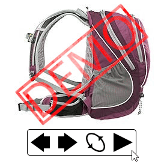

# libpseudo360

Web browser 360 gallery in plain css and javascript.



## Requirements

Web browser compatible with ES5

## Usage

1. Copy `dist` content to your page directory.
2. Add script to html code *(script below)*
3. Configure options [(see: docs)](docs/README.md):
    * `firstImageName`
    * `lastImageName`
    * `imagePath`

```html
<link rel="stylesheet" href="css/libpseudo360.css?v=1.0">
<div id="libpseudo360-main">
    <div id="libpseudo360-loading"></div>
    <div id="libpseudo360-images" style="display: none;"></div>
    <div id="libpseudo360-panel" style="display: none;">
        
        
        
        
        
    </div>
</div>
<script src="js/libpseudo360.min.js"></script>
<script>
    window.addEventListener("load", function () {
        (new LibPseudo360({
            imagePath: "img/",
            firstImageName: "001.jpg",
            lastImageName: "016.jpg",
        })).init();
    }, false);
</script>
```

## Documentation

[Docs](docs/README.md)

### Example

* `index.html`,
* *(favicon.png),*
* directory `img` (example images) 

## Development

Install node, gulp-cli. Install project dependencies.

```shell
npm ci
```

### Static code analisys

```shell
npx eslint js/libpseudo360.js
```

### gulp

Delete `dist/`, copy files and minify script

```shell
gulp
```

Delete `dist/`

```shell
gulp clean
```

Minify script

```shell
gulp minify
```
